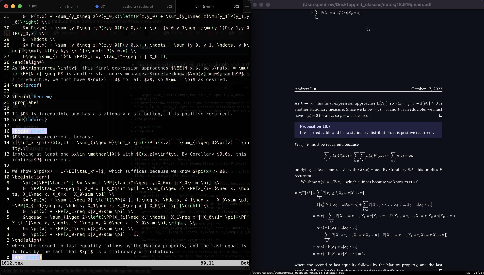

# LaTeX

To take notes and do problem sets, I use my own style file, more details of which can be found [here](https://github.com/yellowtomato98/_andrew.sty).

### setup and workflow

Running
```sh
notes_template <dir>
```
will run a simple script that copies in relevant template files useful for note taking. Running
```sh
pset_template <dir>
``` 
does the same thing, but will copy files that are useful for writing up solutions to a problem set.

Once inside of a tex file, running ```\ll``` turns on [vimtex's](https://github.com/lervag/vimtex) live compilation. Then, running zathura asynchronously, i.e., with 
```sh
:!zathura <filename>.pdf &
```
will open the pdf compiled output that updates on every save. I've found this to be a really lightweight and easy way to take notes with LaTeX.

### note on asymptote diagrams

Normally, compiling an asymptote diagram looks something like this: 
1. compile as usual, e.g., 
```sh
latexmk -pdf
```
This creates raw asymptote files of the form ```<filename>-n.asy```, where ```n``` is the index of the diagram. However, the file will not be able to fully compile because it cannot do step 2 on its own.

2. Compile the raw asymptote with 
```sh
asy <filename>-n.asy
```
which produces ```<filename>-n.pdf```.

3. Now that all of the asymptote is compiled, recompile the entire file with latexmk and the diagrams will show up.  

This is cumbersome and not very compatible with vimtex. Luckily, [there is a fix](https://tex.stackexchange.com/questions/680997/asymptote-figures-dont-appear-with-vimtex). This is bundled into the ```notes_template``` and ```pset_template``` scripts, so there is no extra work needed to compile asymptote with this workflow! 

### screenshot 


